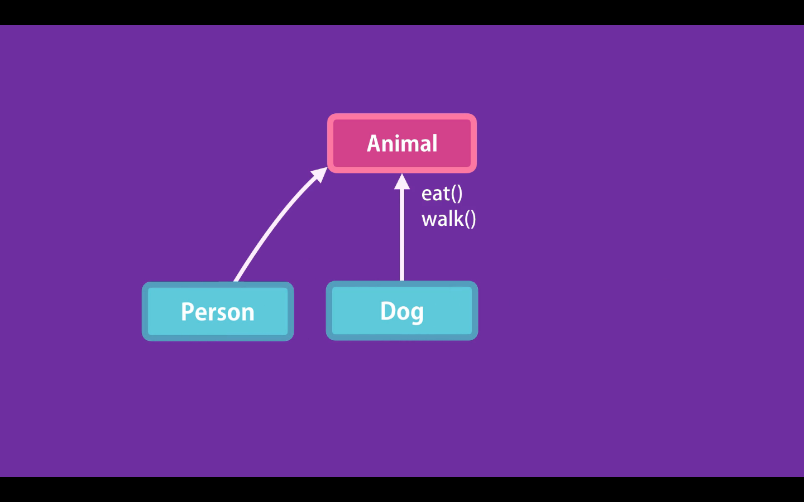

# 07- When to Use Inheritance

While inheritance is a great tool to reuse code we should be careful using it.
It is better to start with simple object, if we see these object share similar features, then we can encapsulate these features in a generic object and inherit those features

In the following example Inheritance may cause some problems.
We may have an Animal object with two methods:

- `eat()`
- `walk()`

The objects that derive from Animal, Person and Dog, can inherit these two methods.

But maybe tomorrow we want to introduce a Goldfish object that also derives form Animal. This can break our hierarchy, because Goldfish can't walk, they swim.

To fix this we need to change our hierarchy, And introduce a Mammal object and a Fish object. This means increasing the complexity of our hierarchy.

Avoid creating inheritance hierarchies. It is best to keep inheritance to one level.
In some situations it is better to favor Composition over Inheritance. With composition in instead of having a complex hierarchy, we can compose a few objects together to create a new object, this technique gives us great flexibility.

So we can have 3 plain JavaScript objects, with certain properties and methods, like:

- `canWalk()`
- `canEat()`
- `canSwim()`

If we want a Person object we can Compose `canWalk()` and `canEat()`. The same for the Goldfish, we can Compose `canSwim()` and `canEat()`. We don't have an hierarchy, and we can combine this object to create new objects.

In JavaScript we can use Mixing to achieve composition.
